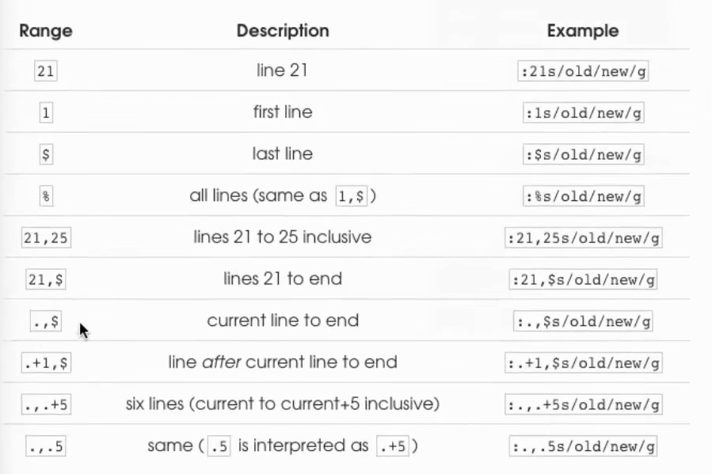

# The Vim of Know-How  
**How do I exit the Vim editor?**
1. 保存并退出 ：
    *  :wq
2. 强制退出：
    * :q!

## Vim 哲学
1. Vim is programmable and Vim's interface itself is a programming language:keystrokes are commands, and these commands are composable.  
2. Vim avoids the use of the Mouse ，because it's so slow  .
3. Vim even avoids using the arrow keys because it requeirs too much movement.  

### 三个主要模式  
> 默认左下角会显示当前所处的模式(无显示即为Normal Mode)  

- Normal Mode  （Command Mode）
- Insert Mode : 插入文本 
- Visual Mode  ： 选择文本   

**Insert Mode**:
1. 在下方插入一行: o  
2. 在上方插入一行：O  
3. 在当前光标后插入: a
4. 在当前光标前插入：i  
5. 在行尾插入:A  
6. 在行首插入：I


### 光标移动  
* 基础移动
    * 左下上右 ： hjkl  
    * 移动到文本第一行: gg  
    * 移动到最后一行/指定行 ：G  
* 进阶移动
    * 移动到下一个单词的开头： w
    * 移动到下一个单词的结尾：e
    * 移动到上一个单词的开头：b
    * 移动到首行：0
    * 移动到第一个非空字符：^
    * 移动到行尾：$  
    * 移动到匹配的括号处： %
    * 移动到变量定义处：gd
    * 移动到前一个没有匹配的左大括号处：[{ 

### 复制粘贴  
1. 复制 ： y
2. 粘贴： p  

### 后悔药  
1. Undo : u
2. Redo : C-r

### 删除 
1. 删除正行 ：dd
2. 删除 字符：x
3. 删除到尾行：D

> 都有剪切的属性 在 

### 替换
1. 替换字符： r
2. 替换到行尾：C/Da
3. 修改大小写：- 


## Composable  命令组合
- 删除2个单词  d2w  
- 删除单词，执行两次 ： 2dw 
- 2d2w  
- 4dd 
- d5j = 在Visual Mode下向下选中5行 然后再按d  


### 搜索替换  

* 搜索下一个目标： / （然后继续按 n 向下搜索  N 为向上搜索）
* 搜索上一个目标： ？      （n 向上搜索  N 向下搜索）
* 快速搜索当前单词： `#` / `*` (向前搜索当当前单词 / 向后搜索当前单词)  ---------------> 针对英文单词  对于中文词语搜索会出现bug 
**这是为什么呢**  
1. * and #的内部搜索模式是： /< word > /  word两侧的符号是单词边界 标记，在英文中一个单词由字母组成，空格或标点就是word的边界
2. 中文环境中 没有天然的 空格 来区分词语  所以在Vim看来，一段连续的中文内容是一个word
3. 所以查找中文的时候 应该使用**正向搜索 /  反向搜索 ？**
* 将range 范围内的 from 替换为 to: `:[range]s/from/to/[flags]`



## 宏  
* 录制宏 ： `q`
* 运行宏：`@`

## 修饰词  
* `i` inner 
* `a` around
* `t` till 
* `f` find 

## split window
* sp 
* vsp 
* 移动窗口 ： C-w [hjkl]

## mark 

* 生成标签 ： m
* 跳转： `


# vimrc 常用配置  
**~/.vimrc 文件配置**
```
"========================================
" 1. 基础系统设置
"========================================
set nocompatible         " 必须！关闭兼容模式，启用Vim的增强功能
syntax enable            " 启用语法高亮
filetype plugin indent on " 启用文件类型检测、插件、和文件类型特定的缩进配置

" 性能与稳定
set history=1000         " 增加历史记录条目
set hidden               " 允许在不保存的情况下切换缓冲区 (常用且重要)
set nobackup             " 不创建备份文件
set noswapfile           " 不创建交换文件 (避免留下临时文件)
set encoding=utf-8       " 统一编码为 UTF-8

"========================================
" 2. 界面与视觉优化
"========================================
" 行号与光标
set number               " 显示行号
set relativenumber       " 启用相对行号 (方便用 `j`/`k` 和数字跳转)
set cursorline           " 高亮显示光标所在的行 (非常实用)
set cursorcolumn         " 高亮显示光标所在的列 (可选，可提高注意力)
set scrolloff=8          " 保持光标上下8行可见
set mouse=a              " 在所有模式下启用鼠标支持
set wrap                 " 不自动换行 (长行超出屏幕时不会折叠显示)

" 搜索与匹配
set showmatch            " 突出显示匹配的括号
set hlsearch             " 搜索时高亮显示匹配项
set incsearch            " 实时显示搜索结果

" 智能搜索 (更少输入)
set ignorecase           " 搜索时忽略大小写
set smartcase            " 如果搜索模式中包含大写字母，则开启大小写敏感搜索

"========================================
" 3. 缩进和Tab设置 (统一使用4个空格)
"========================================
set tabstop=4            " 一个Tab的宽度设置为4个空格
set shiftwidth=4         " 自动缩进的宽度设置为4个空格
set expandtab            " **核心！** 将Tab键输入转换为空格 (推荐)
set autoindent           " 自动缩进
set smartindent          " 智能自动缩进

"========================================
" 4. 文件类型特定配置 (针对编程更友好)
"========================================
" 在粘贴代码时自动关闭自动缩进 (避免格式混乱)
augroup filetype_settings
  autocmd!
  autocmd FileType * set formatoptions-=c formatoptions-=r formatoptions-=o " 禁用自动注释/排版
  autocmd FileType yaml setlocal ts=2 sw=2 expandtab " YAML文件常用2空格
augroup END

" 粘贴模式切换：使用 <F3> 键切换
set pastetoggle=<F3>

"========================================
" 5. 常用快捷键映射 (Leader 键是精髓)
"========================================
let mapleader = " "      " 映射 <Space> 为 Leader 键 (最常用和舒适的 Leader 键)

" 快速操作
nnoremap <leader>w :w<CR>                 " <Space>w: 快速保存
nnoremap <leader>q :q<CR>                 " <Space>q: 快速退出
nnoremap <leader>Q :qall<CR>              " <Space>Q: 退出所有窗口
nnoremap <leader>sv :source $MYVIMRC<CR>  " <Space>sv: 重新加载 .vimrc

" 窗口操作 (使用 <Space> + 方向键 快速切换窗口)
nnoremap <leader>h <C-w>h
nnoremap <leader>j <C-w>j
nnoremap <leader>k <C-w>k
nnoremap <leader>l <C-w>l
nnoremap <leader>v :vsplit<CR>            " <Space>v: 垂直分割窗口
nnoremap <leader>s :split<CR>             " <Space>s: 水平分割窗口

"========================================
" 6. 插件管理器框架 (现代开发必备)
"========================================
" 
" **请注意：** 如果您希望使用插件，您需要安装一个插件管理器（例如 vim-plug）。
" 下面是使用 vim-plug 的基本结构，取消注释并安装后，就能启用插件。
" 
" call plug#begin('~/.vim/plugged')
" 
" " 常用基础插件：
" Plug 'tpope/vim-commentary'      " 使用 gc 快速注释/取消注释
" Plug 'airblade/vim-gitgutter'    " 在边栏显示 Git 差异 (已修改/添加/删除)
" Plug 'preservim/nerdtree'        " 文件树浏览器
" 
" " 建议颜色主题 (取消注释一个，然后 :PlugInstall)
" Plug 'morhetz/gruvbox'
" " colorscheme gruvbox
" " set background=dark
" 
" call plug#end()
" 
" " 插件快捷键示例
" nnoremap <leader>e :NERDTreeToggle<CR>


```
